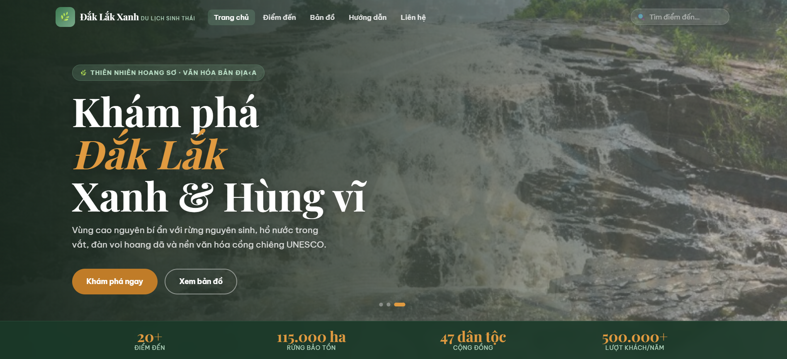

# 🌲 Đắk Lắk Xanh (DakLak Green)

<p align="center">
  
  
  
  <a href="https://github.com/HuyTran271/WEB-PROJECT/stargazers"></a>
</p>

<p align="center">
  <strong>Cổng thông tin & Bản đồ số tương tác dành cho Du lịch Sinh thái Đắk Lắk.</strong><br>
  An eco-tourism web-app for Dak Lak province, leveraging pure Front-end technologies and open-source spatial data APIs.
</p>

<p align="center">
  <a href="#-key-features">Tính năng</a> •
  <a href="#-tech-stack">Công nghệ</a> •
  <a href="#-project-structure">Cấu trúc</a> •
  <a href="#-getting-started">Cài đặt</a> •
  <a href="#-core-algorithms">Giải thuật</a>
</p>

---

## 📸 Giao diện ứng dụng

<p align="center">
  
  <br>
  <em>Giao diện lưới thẻ bài điểm đến và Bản đồ không gian thông minh tương thích đa nền tảng (Responsive Design)</em>
</p>

## ✨ Tính năng nổi bật (Key Features)

- 🔍 **Real-time Global Search:** Ô tìm kiếm trên Navigation Bar bắt sự kiện nhập liệu tức thì, trả về Dropdown tối đa 4 kết quả khớp với tên địa danh hoặc danh mục.
- 🗂️ **Dynamic Client-side Filtering:** Bộ lọc danh mục dạng thẻ (*Rừng, Hồ, Thác, Đô thị cà phê...*) quét mảng dữ liệu cực nhanh, tái cấu trúc lưới UI (`CSS Grid`) không cần reload trang.
- 🗺️ **Leaflet API Map Integration:** Bản đồ số sử dụng tọa độ vệ tinh thực. Ghim vị trí (`Markers`) tự động đổi màu theo danh mục và tích hợp Popup thông tin liên thông.
- 🔲 **Overlay Detail Modal:** Xem sâu thông tin điểm đến (mô tả, giá vé, thời điểm lý tưởng, mảng điểm nổi bật) trên một cửa sổ Pop-up độc lập.
- 🔄 **Infinite Gallery Slider:** Thuật toán tính chỉ số mảng giúp ảnh slide trong Modal xoay vòng vô tận, đi kèm tính năng lưu danh sách yêu thích (**Wishlist**).
- ⚡ **Performance Optimization:** Ứng dụng `IntersectionObserver` để kích hoạt hiệu ứng cuộn trang (Scroll Reveal) và "tải lười" (Lazy Load) bản đồ khi cuộn tới.

## 🛠️ Công nghệ sử dụng (Tech Stack)

* **Core:** HTML5 Semantic, CSS3 (Variables, Flexbox, Grid), JavaScript (ES6+).
* **Libraries:** [jQuery 3.x](https://jquery.com/) (Thao tác DOM và bắt sự kiện nhanh).
* **Mapping API:** [Leaflet.js v1.9.4](https://leafletjs.com/) & [OpenStreetMap](https://www.openstreetmap.org/).
* **Fonts:** `Playfair Display` (Serif cho tiêu đề), `Be Vietnam Pro` (Sans-serif cho nội dung).

## 📂 Cấu trúc thư mục (Project Structure)

```text
daklak-xanh/
├── 📄 index.html          # Trang chủ (Hero slide, Bộ đếm thống kê, Bản đồ mini)
├── 📄 destination.html    # Trang khám phá (Lưới thẻ bài & Thanh công cụ lọc)
├── 📄 map.html            # Trang bản đồ số tương tác toàn màn hình
├── 📄 guide.html          # Trang cẩm nang & Tiện ích câu hỏi xếp nén (Accordion FAQ)
├── 📄 contact.html        # Trang liên hệ & Biểu mẫu Đăng ký (Form Validation)
├── 📂 css/
│   └── 📄 styles.css      # Toàn bộ mã nguồn CSS, biến màu hệ thống và hiệu ứng
└── 📂 js/
    ├── 📄 data.js         # Kho dữ liệu tĩnh (Mảng JSON chứa hồ sơ 6 nhóm địa danh)
    └── 📄 script.js       # Bộ mã logic điều hướng, xử lý bộ lọc, tìm kiếm và Modal
